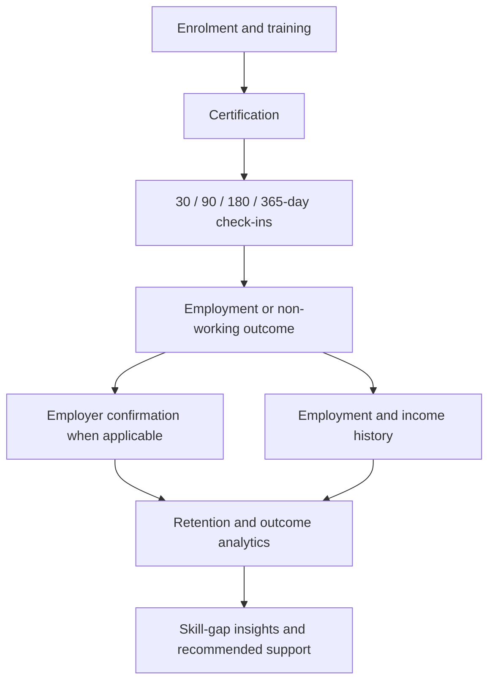
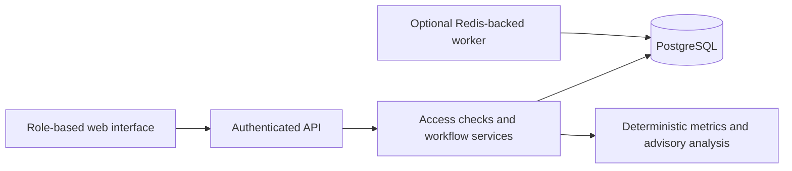

# SkillPulse Maharashtra

**SIH26135 | Smart India Hackathon 2026 | Synthetic Prototype**

SkillPulse tracks what happens after skill training: certification, employment, retention, income growth and further training needs. It connects trainee updates with employer confirmations and gives programme teams evidence for better decisions.

**All demo data is synthetic. This is not an official government service.** The dataset includes 720 trainees across 36 Maharashtra districts, 8 programmes, 6 providers and 6 sandbox employers.

## How It Works



1. **Enrol:** A provider registers a trainee, who receives a permanent SkillID.
2. **Certify:** The provider records training completion with at least 75% attendance and a score of 60/100.
3. **Track outcomes:** The trainee reports work, further education or unemployment through scheduled check-ins. Providers can also record outcomes and send due reminders.
4. **Verify:** A linked employer confirms or disputes the reported starting employment terms, with the trainee's consent.
5. **Review:** Dashboards show placement, retention, income and skill gaps. Recommendations support human decisions; they do not change outcomes automatically.

Employment can be reported before a check-in. Supported working outcomes include salaried work, self-employment, entrepreneurship, apprenticeships and freelancing.

## User Roles

### Government Officer

Reviews consent-filtered programme outcomes through dashboards, district comparisons, skill intelligence, the advisor and reports. Can identify areas needing follow-up or training support.

**Access limit:** Aggregate information only. Cannot open individual trainee profiles, edit outcomes or certify trainees.

### Trainer / Training Provider

Creates programmes, enrols trainees, records certification and reports outcomes for their organisation. Can request employer verification, send due check-in reminders, review skill gaps and view provider-scoped analytics.

**Access limit:** Own provider's trainees and programmes. Cannot change trainee consent or contact details, submit their check-in answers or confirm employment as an employer. There is no separate trainer role; trainers use provider-linked accounts.

### Employer

Reviews consented requests linked to their organisation. Confirms four starting terms: employment, role, salary and start date. Each confirmation contributes 25 points; all four produce **Verified**, otherwise the result is **Disputed**.

**Access limit:** Own organisation's verification requests only. Cannot browse full trainee profiles, see contact details or edit wage history. Confirmation does not verify later self-reported income.

### Trainee

Views their SkillID, training, certificates, employment history and wages. Updates their own contact/location details, manages consent, reports outcomes, completes due check-ins and requests skill-gap advice.

**Access limit:** Own profile only. Cannot certify training, act as an employer reviewer or resubmit a completed checkpoint. SkillID stays unchanged when contact, location or employment changes.

### Administrator

Coordinates operations across providers: programmes, enrolment, certification, reported outcomes, follow-up reminders, analytics and audit review.

**Access limit:** Administrative access does not allow changing trainee consent, submitting their check-ins, confirming employer terms or viewing decrypted contact details through the profile API.

## Main Features

| Area | What it provides |
| --- | --- |
| Trainee journey | Permanent SkillID, training, certification and an outcome timeline |
| Follow-ups | Due check-ins at 30, 90, 180 and 365 days after certification |
| Employment verification | Employer confirmation or dispute of starting terms |
| Income history | New wage observations without replacing earlier records |
| Analytics | Cohort filters, district map, programme comparisons and retention indicators |
| Skill intelligence | Assessment-based gaps and recommended training support |
| Reports | Outcome summaries, JSON export and browser print/PDF |
| Privacy and audit | Purpose-specific consent, server-enforced access and recorded actions |

**Reading the numbers:** Placement means ever working among certified trainees; it is different from current employment. Retention requires evidence after the first placement reaches the milestone, so missing responses are not assumed to mean retention. Follow-up dates are based on certification, not placement. Wage growth uses paired observations for the same person. These measures are descriptive, not proof that training caused an outcome.

## Run Locally

**Requirements:** Node.js 22 LTS, npm and internet access for initial installation. A cloud account, Docker and an AI key are not required for the native demo.

In the project folder, start the local database:

```powershell
npm ci
npm run setup:local
npm run db:generate
npm run db:local
```

Keep that terminal open. In a second terminal:

```powershell
npm run db:migrate
npm run db:seed
npm run dev
```

Open **http://localhost:3000** and choose a demo role. Use `localhost`, not `127.0.0.1`, to match the configured application origin.

- Setup generates secrets in `.env` and preserves existing settings. Never commit this file.
- Native PostgreSQL runs on port **54329**, with persistent data in `.local/postgres`.
- Seeding preserves an existing dataset rather than resetting completed demo actions.
- If port 3000 is occupied, set `APP_ORIGIN=http://localhost:3001` and run `npm run dev -- --port 3001`.

### New Trainee Accounts

Enrolment creates a profile with all consent purposes disabled. A local demo operator can provision the login:

```powershell
npm run account:create -- MH-SK-2026-XXXXXX trainee@example.invalid
```

The command prints a generated password once for private delivery. The trainee signs in and chooses consent. This is a local demo process, not a production invitation or password-recovery system.

## Suggested Demo

On a fresh dataset, follow **Rahul Patil**, SkillID `MH-SK-2026-000001`, a Solar PV Installer trainee in Pune:

1. **Provider:** Open Rahul's profile and inspect his training, certificate and placement.
2. **Employer:** Confirm his four starting terms, including income of **INR 15,000**.
3. **Trainee:** Complete the due 90-day check-in with the same employer and income of **INR 18,000**.
4. **Trainee or provider:** Review the **20% wage increase** and run skill-gap analysis. The 48/100 Advanced Troubleshooting assessment produces a high-severity fallback recommendation.
5. **Government officer:** Review refreshed outcomes, recommendations and the report.

The **Demo journey** screen guides role switching. If a checkpoint is already complete, keep its history; use a separate fresh database for a pristine presentation.

## Technical Overview

**Stack:** Next.js, React, TypeScript, Tailwind CSS, Prisma and PostgreSQL. Recharts powers charts, Leaflet powers the district map, and optional BullMQ/Redis processing delivers scheduled in-app reminders.



The server checks role, ownership, consent where required and workflow state. Outcome writes use transactions and trainee-level locks to prevent conflicting updates. KPI calculations are deterministic; optional AI is advisory only.

```text
prisma/          Database schema, migrations and synthetic seed
scripts/         Local setup, account provisioning and integration checks
src/app/         Pages, API routing and global styles
src/components/  Dashboards, profiles, role workflows and shared controls
src/server/      Security, workflows, metrics, analytics, AI and worker
src/lib/         Client helpers, types and formatting
tests/           Metric unit tests
Dockerfile       Container build
compose.yaml     Container services
```

### AI And Reminders

Without AI credentials, the advisor and skill-gap review show **labelled rules-based evidence**. Optional settings in `.env` are `AI_BASE_URL`, `AI_API_KEY` and `AI_MODEL`. The default requested model is `GPT-6-astra`; its availability is **unverified**. Use a compatible provider/model you can access. Generated responses are schema-validated, and generation failures fall back to rules.

The model cannot change employment, wages, consent or KPIs. Recommendations require human review; the app does not assign or execute interventions.

Without Redis, trainees can still answer due check-ins and providers can send in-app reminders. For scheduled delivery, configure `REDIS_URL` and run `npm run worker`. SMS, email and WhatsApp delivery are not implemented.

### Docker Alternative

With Docker Desktop running Linux containers:

```powershell
npm run setup:local
docker compose config --quiet
docker compose up --build -d
docker compose run --rm seed
```

Stop the native web server first if it occupies port 3000. Docker uses a separate PostgreSQL database and persistent volumes. Use `docker compose stop` to preserve them. Configuration examples are in `.env.example`; do not change encryption keys or database passwords without planning for existing data.

## Privacy And Limitations

- **Consent:** Trainees independently control follow-ups, employer verification, individual AI analysis and analytics participation. Withdrawal blocks the relevant future use; AI withdrawal also removes stored gap recommendations. It does not erase the entire journey or recall downloaded reports.
- **Access:** Server-side role and ownership checks protect records. Contact fields use AES-256-GCM, passwords use bcrypt, and sessions use HttpOnly cookies. Small analytics cohorts are suppressed.
- **Prototype scope:** One checkpoint series per trainee, not per repeated enrolment. No job board, lesson delivery, production onboarding or dedicated dispute-resolution workflow.
- **Deployment:** Do not use real personal data or expose demo access publicly. Production use needs stronger identity, abuse protection, key management, backups and privacy review. Audit rows are not tamper-proof.
- **External services:** Map tiles need network access. Docker/Redis execution and live AI connectivity have not been tested in the current environment.

## Validation

```powershell
npm run test
npm run lint
npm run typecheck
npm run test:integration
```

Integration checks require the running app, seeded database and `DEMO_MODE=true`. They use a disposable trainee to check access boundaries, consent, verification, duplicate submissions, wage history and retention without changing Rahul's records.

For a production build, stop the web server and run `npm run build`. On Windows, a running Prisma process can lock the native DLL needed during the build.

Previous checks passed 5 unit tests, 43 integration HTTP checks, lint and production compilation. Browser checks covered key role flows, responsive layouts, report data and print layout; browser file saving remains unverified.